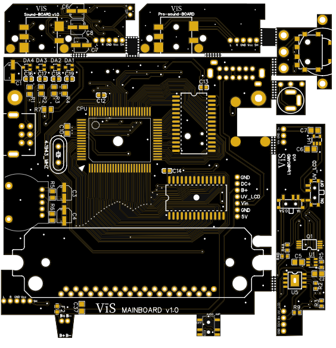
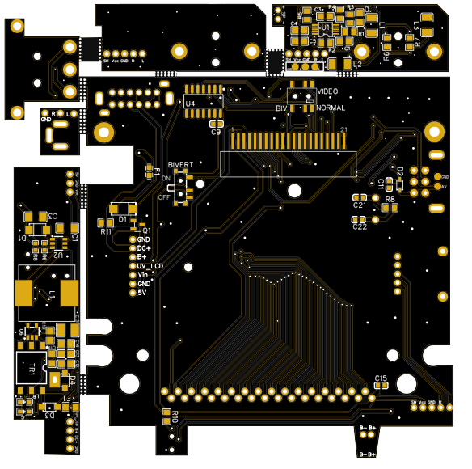
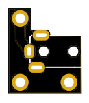
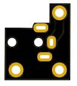
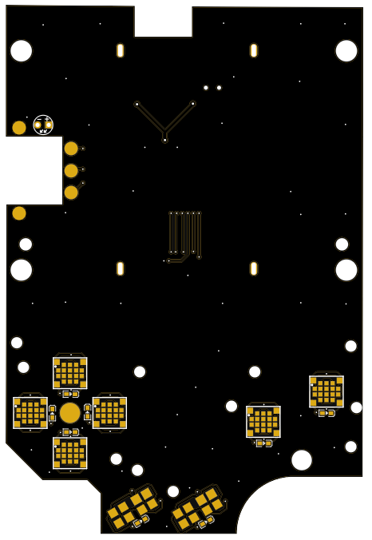
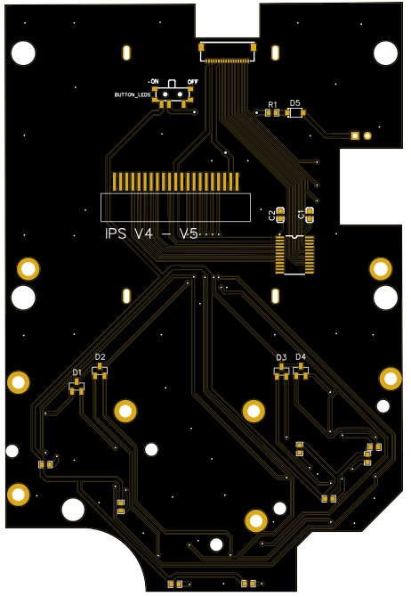

# Production information

## Mainboard Gerber file

Produce the mainboard Gerber file with 1 mm thickness (I suggest ENIG surface finish). Here you have 6 designs, and the various PCBs can be easily separated along holes.

 

## DC jack holder Gerber file

Produce the DC Jack holder Gerber file with 1.6 mm thickness.

 

## Audio Jack raiser Gerber file

Produce Audio Jack raiser Gerber file with 1.6 mm thickness. Here you have 4 designs that, once printed, must be separated (they are very fragile and break easily). 
I used a panelized Gerber file, and hence, when produced, you will have a lot of these very little boards. Since these boards are very small, when ordering, specify 
that you will accept all the risks during production. 
 

## IPS front PCB Gerber file

Produce the IPS front PCB Gerber file with 1.2 mm thickness (I suggest ENIG surface finish). 
 

