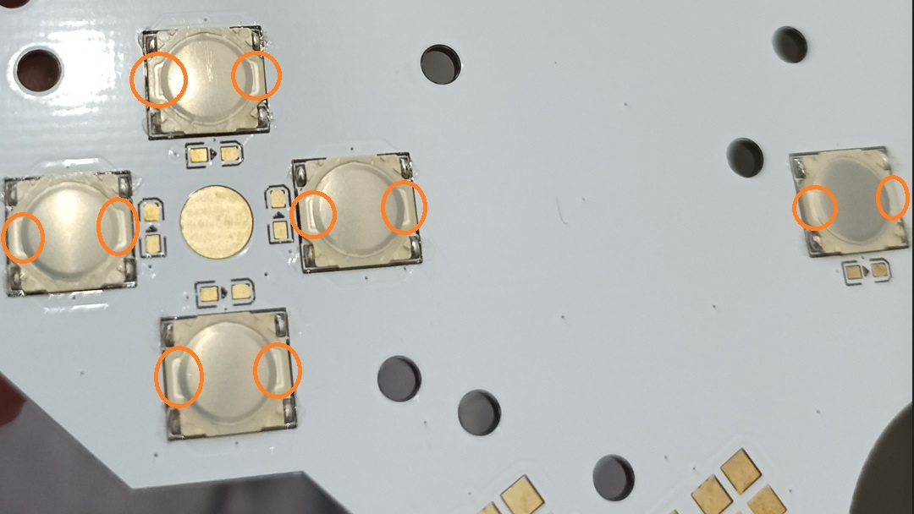

# VIS_Game_Boy_DMG

This project was born with the aim of saving corroded boards of **Gameboy DMGs** or **SNES Super Gameboy adapter**s. For this reason, I developed replacement PCBs by using modern electronic components. Several exisisting DMG mods are included:
- **Lipo power board** that also provides the negative voltage required for the **original LCD** (this voltage can be turned off through a switch if an **IPS screen** is used). Thanks to a **brand new 2.5A DC jac**k, a lipo battery can be safely charged at 0.5 or 1 A. In addition, it is possible to **play while charging** by using only the current coming from the DC jack.
- **Audio board** with all the audio circuits on it in which **1w speaker** or the **original speaker** is directly connected (Audio is not sent to the front PCB, and, for this reason, any power absorbing on the front PCB does not affect audio). Audio amplifier can be disabled to save battery life or to use only the pro-sound jack.
- **Integrated bivert chip**.
- I also developed a **replica of the OSD IPS (v4 or v5) board** with **button LEDs** and **tactile buttons**.
- **Housing shell doesn't require any cut** apart from those required by the IPS LCD mod.

Videos related to this project can be found on my [YouTube Channel](https://www.youtube.com/channel/UC17bQxOnCBejYQG4rzEg3jA).

## Disclaimer

**This is a DIY project for electronic enthusiasts. For this reason, I am not responsible for any damage incurred while attempting this project or after completion of the project. You alone accept all risk since you are 100% liable for damage to yourself or your property.**

## Switches/selectors

Before assembling the console, the following switches or selectors must be properly set:
  - The switch on the mainboard to **turn ON/OFF the bivert chip**.
  - The selector on the mainboard to **use normal video or biverted video**.
  - The switch on the powerboard to **turn ON/OFF the negative voltage** required by the **original LCD**.
  - The selector on the powerboard to **set 0.5 A or 1 A charger**.
  - The switch on the IPS board to **turn ON/OFF the button LEDs**.
    
Finally, from the battery compartment, it is possible to **ENABLE/DISABLE the audio amplifier** without opening the console.

## Required Donor parts

In this project, the **strictly required donor parts** are only 
  - the **CPU** (that can be sourced from a donor DMG mainboard or a SNES super Gameboy adapter).
  - the **link-port** (that can be sourced from a donor DMG mainboard or from a 4-player adapter DMG-07).

Other **optional components to desolder** from a donor console are:
  - **RAM** chips (can be sourced from a donor DMG mainboard or a SNES super Gameboy adapter) or the Alliance AS6C6264-55SIN RAM chips can be purchased.
  - **Card slot connector, volume wheel, and quartz oscillator** can be sourced from a donor DMG mainboard or can be simply purchased on Aliexpress.
  - **Power switch** can be sourced from a donor DMG mainboard, or a brand new switch can be purchased at any electronic components shop (see BOM file).

## Required Parts to purchase or reuse

  - **All the electronic components** reported in the BOM file.
  - **Housing DMG shell case** (optional if you already have one).
  - **IPS LCD kit** (optional if you want to use the original front PCB). If you want to use the VIS front PCB, you have to buy the v4 or v5 OSD version (see the FAQs [here](FAQs.md) for more details). You can find (in the files of this project) the 3D model of the LCD bracket (IPS v5). You can simply 3D print it (I suggest transparent), and then you can prepare it with sandpaper and paint it with the color you need. This model of the bracket fully masks the entire LCD (it is useful if you use a transparent shell).
  - **3.7V 125054 Lipo battery** (optional if you want to use only the DC jack)  (see the FAQs [here](FAQs.md) for more details).
  - **5V 2A USB-C charger** with a DC jack adapter (it is shown at the end of the instructions).
  - **Kitsch-Bent full silicone buttons** (optional).
  - **1 Watt speaker** (optional if you want to use the original DMG speaker).  You can find (in the files of this project) the 3D model of the holder that you can use to take it in place without glue it to the housing shell.
  - **wires and ph2.0 housing connectors** reported in the last sections of the BOM file (optional since you can solder directly wires on the boards).

## Setup instructions

The most **difficult parts** of the project are the following:
  - **Desolder** the components from the donor console by using a hot air gun. For this step, I suggest searching videos on youtube regarding the **SYF Game Gear** setup in which it is shown how to desolder the game gear CPU. Desoldering with a hot air gun became extremely easy if you use the adapters shown in the following image (search by using their codes on Aliexpress to find them).

    
    
  - **Drag soldering** a 0.5 mm pitch SMD component. Also, in this case, you can refer to the videos made for the **SYF Game Gear** since solder the Game Gear single CPU version has the same type of difficulty.

These instructions must be integrated by watching and following the youtube videos [presentation video](https://youtu.be/PxOyTZqpqn4) and [setup video](https://youtu.be/e4qCekoWYW4).

First of all, you need to desolder a gameboy CPU from a gameboy DMG or from a super gameboy. Then, from a Gameboy DMG or from a DMG-07 adapter, you need to desolder the link port connector.

*OPTIONAL: you can also desolder the power button (that can be reused or that can be internally restored), the 2 RAM chips, and the cartridge slot reader (both can be reused).*

**IMPORTANT:** Please be sure that the following connections are properly made:

  - **STEP 1** *(OPTIONAL): Restore the power button (see the setup video from 00:54 to 06:38)*.
    
    **Tip:** Differently from the video, you can use the brand new power switch directly (you find it in the BOM file) because a perfect combination between the original and the new switches is very hard to obtain. If you use the new button reported in the BOM file, firstly, it is not required to shorter the black plastic, and then, to make it all good, you can add a little tape, as shown in the following photos, to fit the space better.
    
    
  - **STEP 2**: Populate the **power board** (see the setup video from 06:39 to 13:28).

    
  - **STEP 3**: Populate the **mainboard**. 
    -	First, start with the components required to test only the power board and the battery charging circuit (see the setup video from 13:28 to 19:45).
    -	Then, test the power board and the battery charging circuit (see the setup video from 19:45 to 23:19). If the RED or GREEN LED doesn’t work probably, you have installed it in the wrong orientation.
    -	Once verified that the previous steps are OK, you can populate the mainboard entirely in a standard way (check the setup video from 23:19 to 24:42 to understand how to solder some components in the correct location).
    -	Check the installation and the various switches (see the presentation video from 03:11 to 05:00) without the audio board just to be sure that the first 2 boards are ok. NOT exceed 6v (I suggest using 5v) power supply; otherwise, you will fry the TP4056 charger chip (only this chip will be damaged if you provide a voltage until 24v.In any case, use 5v!!!).

     	
  - **STEP 4**: Populate the **audio board**.
    -	Populate entirely the audio board paying attention to the inductances L1, L2, and L3 (they are very fragile). In addition, the location of the electrolytic capacitors must be very accurate.
    -	Choose the R2, R4 resistors for the speaker that you want to use (the original 0.25w speaker or the 1w speaker).
    -	Solder the 2 little PCB to add thickness (see the setup video from 25:03 to 28:58).
    -	Optional (also populate the pro-sound board and solder its 2 little PCBs for the thickness).
    -	Check the audio board and the switch on the mainboard to turn ON/OFF the audio amplifier (once assembled, the console this switch can be used from the battery compartment. This can be useful to save battery by disabling the audio amplifier or to use the pro-sound jack always by disabling the audio amplifier).

     	
  - **STEP 5**: Populate the **IPS board**.
    -	Firstly, you can populate the IPS board entirely by skipping soldering the button LEDS, the button resistors, and the contrast wheel (see the setup video from 28:58 to 29:55). Here on the power board, you can turn off the unregulated voltage required only with the original LCD.
    -	Then, you can solder and test the contrast wheel (also required to change the settings of the IPS panel) (see the setup video from 29:55 to 33:30). In the video has been used an old version of the board having problems with the holes for the LED (now don’t worry about this since it has been fixed).
    -	Then, you can install LED buttons, LED resistors, and the switch to turn ON/OFF these LEDs (see the setup video from 33:30 to 35:01). 
    -	Finally, test the buttons and their LEDs.
      
      
    - Pay attention to the orientation of the tactile buttons (the circled part of the following image must stay on the left and right for all the tactiles and not on the upper or lower part).

      
  - **STEP 6**: Clean all the boards from flux and assembly the board (see the setup video from 36:28 to 42:20). Remember to properly set the switches for various options: bivert chip ON/OFF, normal video signal or biverted video signal, 0.5 A or 1 A charger, unregulated voltage (used only by the original LCD) ON/OFF, button LEDs on the IPS board ON/OFF.

**WARNING** Don't do a bath of 15/30 minutes for the IPS board if tactiles are installed (keep them outside the IPA; otherwise, the glue that keep metal pieces will be dissolved and switches break). I solder the tactiles after the bath in IPA without using additional flux (I simply exploit the flux of the soldering tin).

**SUGGESTED ITEMS**: I suggest using a 5v 2A USB-C charger with the adapter shown in the following image to play while charging at 1A. I suggest you buy a 125054 Lipo battery that has a perfect fit into the shell. 

Finally, I suggest to use full silicone buttons from Kitsch-Bent as shown in this [short video](https://www.youtube.com/watch?v=DBGJTIemyE4&t=64s&ab_channel=V1sModding).

**NOTE**: When you start to hear aliens coming from the speaker and the screen starts flashing, it means that you have to charge the battery. I have not disabled the CPU in this case to give you the time to attach the power supply without losing the game in progress!!!

## FAQs

link [here](FAQs.md).

## Troubleshooting

link [here](troubleshooting.md).

## Acknowledgements

I would like to thank Mathijs (the creator of SYF Game Gear PCBs) for his several suggestions, schematics, and help in this project.

## License
 This work is licensed under a <a rel="license" href="http://creativecommons.org/licenses/by-sa/4.0/">Creative Commons Attribution-ShareAlike 4.0 International License</a>. You are able to copy and redistribute the material in any medium or format, as well as remix, transform, or build upon the material for any purpose (even commercial) - but you **must** give appropriate credit, provide a link to the license, and indicate if any changes were made.

## Contacts

**email**: vis.modding@gmail.com  

**discord**: you can find me as *vis_modding* on several servers (BennVenn, Mouse Bit Lab, Retrosix modding, Game Boy, Gameboy makers).
