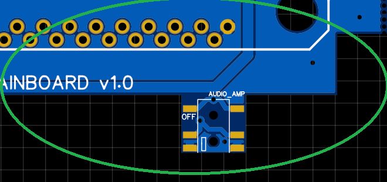
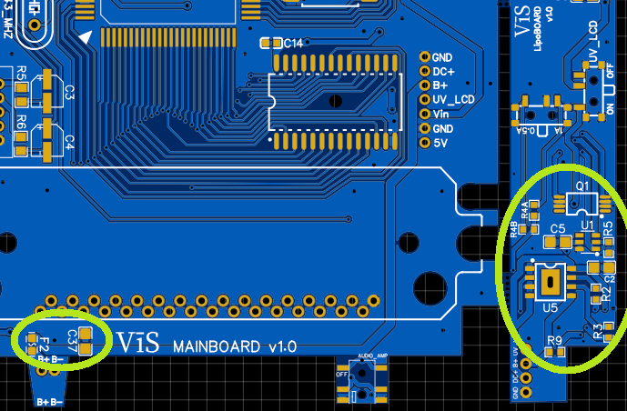
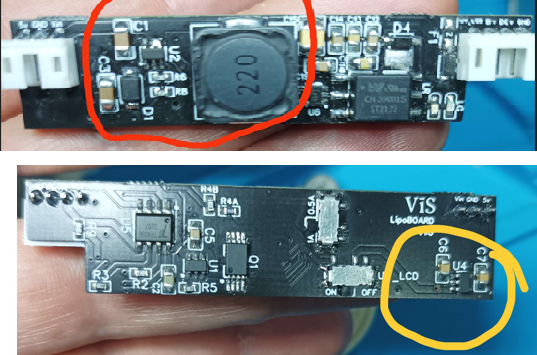
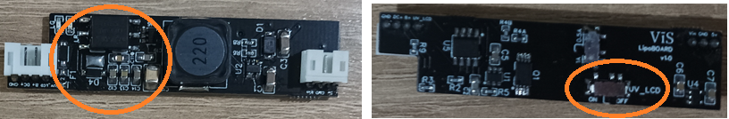

# Troubleshooting

## Gameboy turns on for just one second

If you have used a SNES CPU and you turn on the Gameboy without a game inside, it is expected that it turns off if you are using the original 
front PCB or the IPS v4 kit (with IPS v5 it stays on also without a game inserted).

## No audio issue

If you don't hear audio or strange audio be sure you have turned the amplifier ON (lower position). See the following image.

## No clean sound or audio coming from only one channel of the headphone

Rework the soldering of the audio amplifier

## Battery not recognized or not properly charging

Check D1, R11, Q1 components on the mainboard and check the following circled components on the mainboard and power board.

## Not enough power 

If you don't have enough power, especially if the unregulated voltage is not stable while using the original LCD, you need to rework the boost converter 
and the LDO components on the power board (they are circled in the following image). 

## Everything works well, but the original LCD is off

Check firstly that its switch on the power board is set to ON otherwise, check the circled components in the following image.

