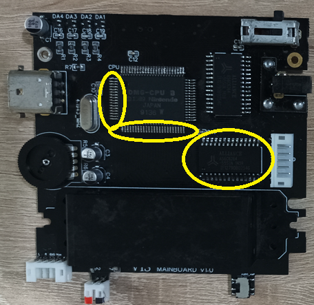

# Troubleshooting

## Gameboy turns on for just one second

If you have used a SNES CPU and you turn on the Gameboy without a game inside, it is expected that it turns off if you are using the original 
front PCB or the IPS v4 kit (with IPS v5 it stays on also without a game inserted).

## No audio issue

If you don't hear audio or strange audio be sure you have turned the amplifier ON (lower position). See the following image.

## No clean sound or audio coming from only one channel of the headphone

Rework the soldering of the audio amplifier. Use an electrolytic capacitor for C1 on the mainboard as suggested in the BOM file.

## Battery not recognized or not properly charging

Check D1, R11, Q1 components on the mainboard and check the following circled components on the mainboard and power board.

## Not enough power 

If you don't have enough power, especially if the unregulated voltage is not stable while using the original LCD, you need to rework the boost converter 
and the LDO components on the power board (they are circled in the following image). 

## Everything works well, but the original LCD is off

Check firstly that the switch on the power board is set to ON; otherwise, check the circled components in the following image.

## The DC jack seems to be dead

Check firstly the connections between the DC jack PCB and the mainboard and also check the F1 fuse on the mainboard.

## The Gameboy does not read any game and shows a corroded logo

Rework the solder of the cartridge slot connector and the CPU pins, and the RAM pins circled in the following image.

## Buttons/Button LEDs problem

Some button problems are known. For example, all buttons work, but the B button and left D-PAD not. This is a common problem caused by a wrong insertion of the 21 pins ribbon cable that causes the -21v line to reach the trace of these buttons. In this case, the CPU is fried (Please fully test the CPU before installing it). In any case, try to reflow the CPU.

Other problems can be a general malfunction of the buttons (for example, buttons sometimes work and sometimes do not). Probably, in this case, you have to replace the FPC connector since it can be damaged, especially if you have bent it and you have inserted and removed it several times. Also, video issues can be related to a bad FPC connector.

In addition, if you have installed tactile buttons, be sure of their orientation (check it in the read me section).

Finally, if button LEDs are OFF, firstly, check if the switch on the IPS board is enabled. In this case, check if you have installed the resistors for the LEDs (those without the labels on the back of the IPS board). As a final check, be sure that LEDs are soldered in the right orientation.

